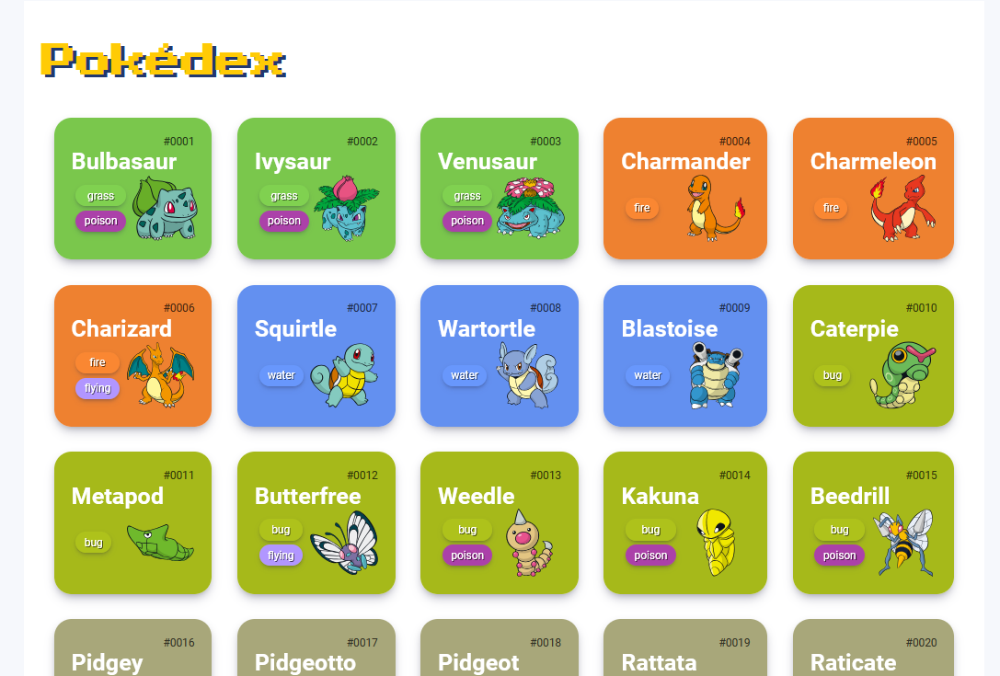
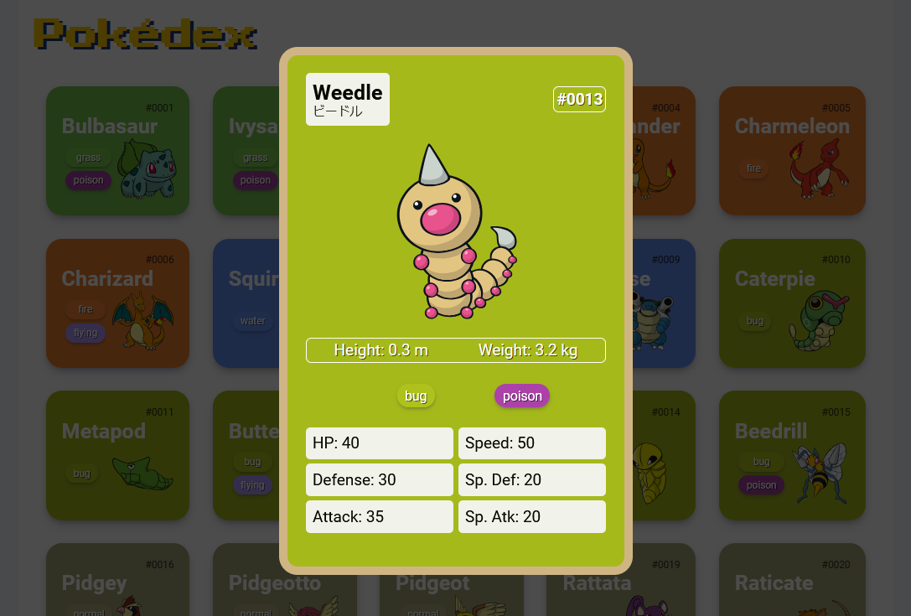

# Pokédex JavaScript


Uma Pokédex interativa desenvolvida como parte do desafio "Construindo uma Pokédex com JavaScript" da DIO (Digital Innovation One). Este projeto consome a [PokéAPI](https://pokeapi.co/) para exibir informações sobre Pokémon em uma interface responsiva e amigável.

## 📸 Preview do Projeto



## 🌟 Funcionalidades

- Lista os primeiros 251 Pokémon (1ª e 2ª Geração)
- Carregamento dinâmico com botão "Load More"
- Exibição de tipos com cores correspondentes
- Cards interativos com efeito hover
- Design responsivo
- Imagens de alta qualidade dos Pokémon

## 🚀 Tecnologias Utilizadas

- HTML5
- CSS3
- JavaScript
- Fetch API

## 💻 Estrutura do Projeto

```
├── index.html
├── assets/
│   ├── css/
│   │   └── pokedex.css
│   └── js/
│       ├── main.js
│       ├── poke-api.js
│       └── pokemon-model.js
```

## ⚙️ Como Executar

1. Clone este repositório
2. Abra o arquivo `index.html` em seu navegador
3. Ou acesse através de um servidor local

## 🎨 Features Visuais

- Cards com cores baseadas no tipo do Pokémon
- Animação de escala ao passar o mouse sobre os cards
- Clicar no mini card abre um card maior na tela
- Sombras suaves para dar profundidade
- Layout grid responsivo

## 🔄 Limitações

- Sem sistema de busca ou filtros
- Dependente de conexão com internet para funcionar

## 👨‍💻 Autor / Author
Renato (GitHub: @RNTrybusy)

## Licença / License
Este projeto está sob a licença MIT - veja o arquivo LICENSE para detalhes.

This project is licensed under the MIT License - see the LICENSE file for details.